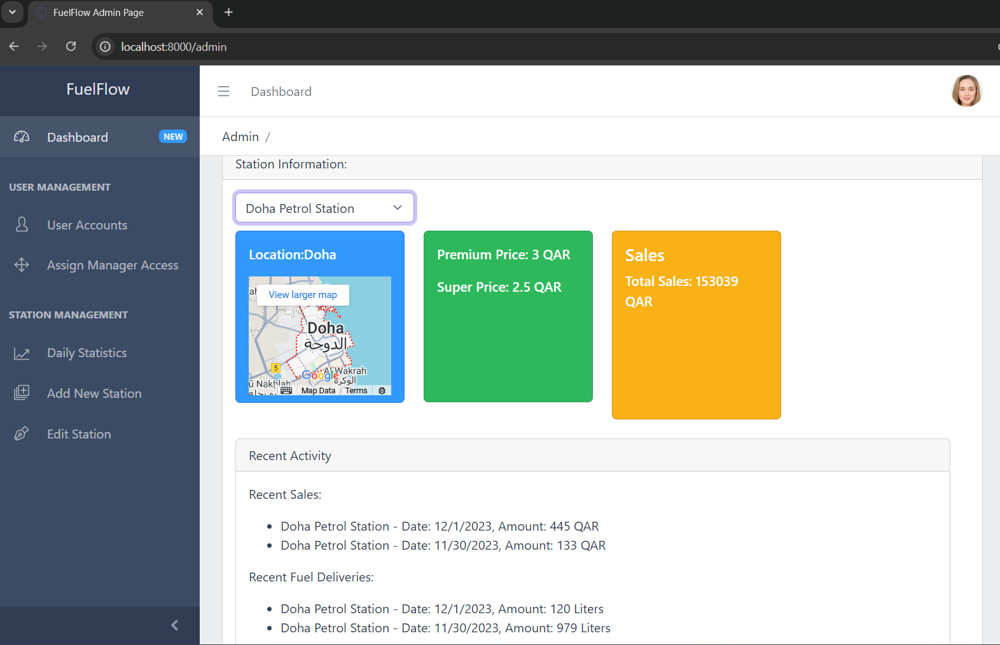
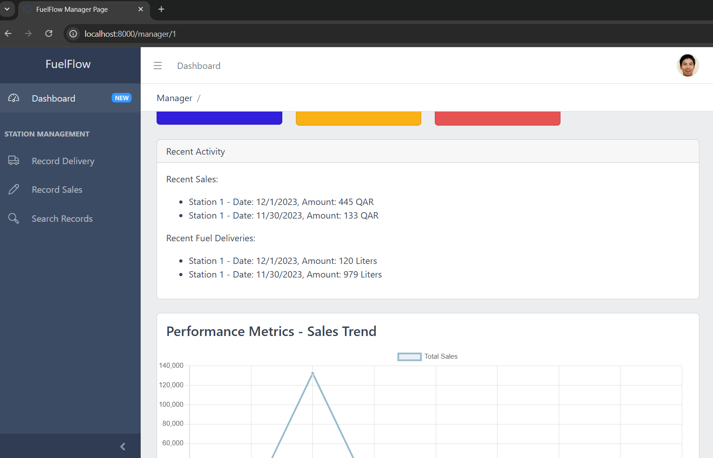
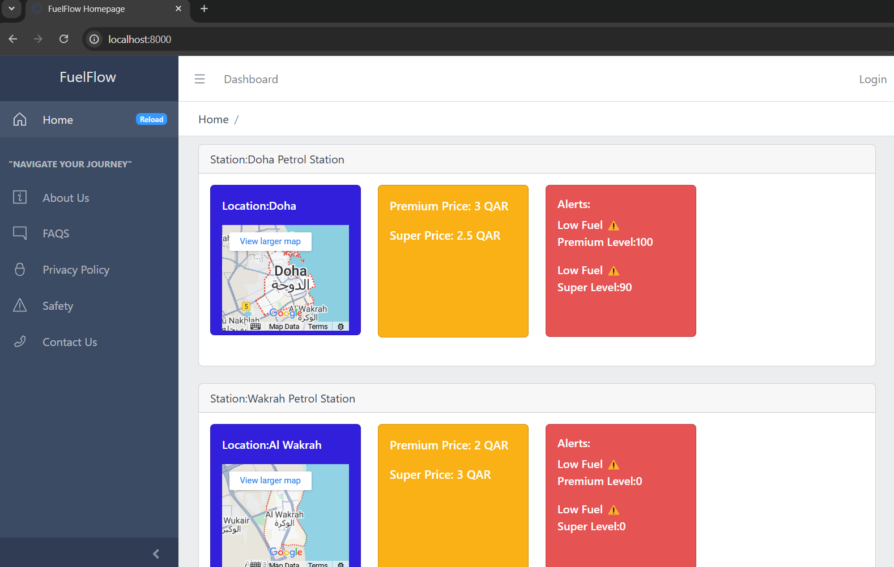
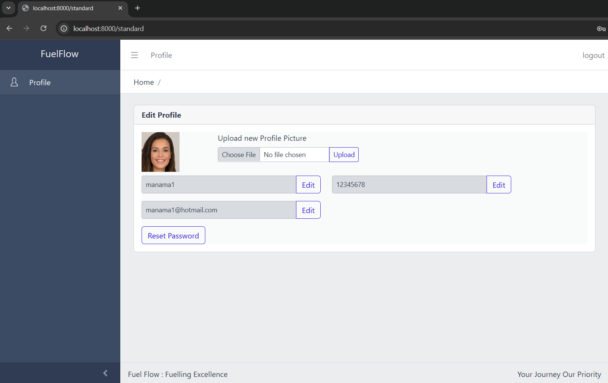
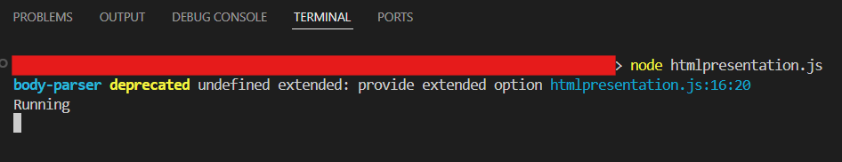

# FuelFlow - Web-Based Petrol Station Management System

A web-based solution for petrol station management, catering to administrators, managers, and the public. This system monitors daily sales and fuel levels across multiple stations, providing real-time data and management tools.

## Table of Contents

-   [Features](#features)
-   [Installation](#installation)
-   [Usage](#usage)
-   [Folder Structure](#folder-structure)
-   [Demo Screenshots](#demo-screenshots)

## Features

*   **User Roles:** Distinct roles for administrators, station managers, and public viewers, each with specific access levels.
*   **Administrator Dashboard:** Overview of all stations, fuel price management (premium and super), and user/station management.
*   **Station Manager Functionality:** View current pricing, record daily sales and fuel levels (with overwrite warning), record fuel deliveries, and view historical data for their station.
*   **Public View:** Real-time display of station locations, current fuel prices, and fuel availability status (low stock warnings).
*   **Session-based Authentication:** Secure login system for administrators and managers.
*   **Backend:** Node.js and MongoDB for robust data management.
*   **Frontend:** HTML, CSS, JavaScript, and Handlebars for a responsive user interface.
*   **Responsive Design:** Accessible on various devices.
*   **CSRF Tokens:** Protection against Cross-Site Request Forgery attacks.

## Installation

**Requirements:**

*   Node.js must be installed.
*   MongoDB must be installed and running.

**Steps:**

1.  Clone the repository (if applicable).
2.  Navigate to the project directory in your terminal.
3.  Install the required Node.js modules by running the following command:

    ```bash
    npm install cookie-parser express express-fileupload jimp mongodb nodemailer sharp
    ```

4.  Set up your MongoDB database. Sample JSON files for database creation are included in the `json` folder.
5.  **Important:** After setting up the MongoDB database, update the database connection string in `persistence.js` (line 12) with your actual connection details.

## Usage

After completing the installation steps and setting up the database:

1.  Open your terminal in the project directory.
2.  Run the following command to start the application:

    ```bash
    node htmlpresentation.js
    ```

## Folder Structure

*   `json`: Contains sample JSON files for MongoDB database initialization.
*   `static`: Stores static assets like images and CSS files for the frontend.
*   `templates`: Contains Handlebars template files for the frontend.
*   `persistence.js`: Handles direct communication with the MongoDB database.
*   `business.js`: Contains the application's business logic, interacting with the presentation and persistence layers.
*   `presentation.js`: Handles interactions with the user/frontend.


## Demo Screenshots

*   **Administrator Dashboard:**
    
    *   Description: This screenshot shows admin dashboard which provides an overview of all stations, current fuel prices, and options for managing users and stations.

*   **Station Manager View:**
    
    *   Description: This screenshot displays the interface for station managers to record daily sales and fuel levels, view current pricing, and access historical data.

*   **Public View:**
    
    *   Description: This screenshot shows the public view with a list of stations, their locations, current fuel prices, and fuel availability status.

**Registered/Logged-in User View:**
    
    *   Description: This screenshot demonstrates the interface for logged-in users to manage their profiles (e.g., changing password, updating contact information).

*   **Running the Application:**
    
    *   Description: This screenshot demonstrates how to run the application using the command `node htmlpresentation.js` in the terminal.

